# Data Model: Smart Tag-Based Resource Fetcher

**Date**: 2025-12-24
**Branch**: `001-dspy-tag-fetcher`

## Entities

### Resource

The primary data object representing a searchable item.

| Field | Type | Constraints | Description |
|-------|------|-------------|-------------|
| `uuid` | `str` | Primary key, UUID v4 format | Unique identifier for the resource |
| `name` | `str` | Required, 1-200 chars | Human-readable name (generated via Faker) |
| `description` | `str` | Required, 1-1000 chars | Descriptive text explaining the resource |
| `search_tag` | `str` | Required, 1-100 chars | Categorization label for semantic matching |

**Pydantic Model**:

```python
from pydantic import BaseModel, Field
import uuid as uuid_lib

class Resource(BaseModel):
    uuid: str = Field(..., description="Unique identifier (UUID v4)")
    name: str = Field(..., min_length=1, max_length=200, description="Human-readable name")
    description: str = Field(..., min_length=1, max_length=1000, description="Resource description")
    search_tag: str = Field(..., min_length=1, max_length=100, description="Categorization tag")

    model_config = {
        "json_schema_extra": {
            "example": {
                "uuid": "550e8400-e29b-41d4-a716-446655440000",
                "name": "Ergonomic Office Chair",
                "description": "A comfortable chair designed for long work sessions.",
                "search_tag": "work"
            }
        }
    }
```

**Lifecycle**: Resources are created once on application startup and remain immutable for the lifetime of the process. No create/update/delete operations are exposed via API.

---

### SearchResult (Response Wrapper)

Wrapper for search endpoint responses.

| Field | Type | Description |
|-------|------|-------------|
| `results` | `list[Resource]` | List of matching resources |
| `count` | `int` | Number of results returned |
| `query` | `str` | The original search tag (echoed back) |

**Pydantic Model**:

```python
class SearchResponse(BaseModel):
    results: list[Resource] = Field(default_factory=list, description="Matching resources")
    count: int = Field(..., ge=0, description="Number of results")
    query: str = Field(..., description="Original search tag")

    model_config = {
        "json_schema_extra": {
            "example": {
                "results": [
                    {
                        "uuid": "550e8400-e29b-41d4-a716-446655440000",
                        "name": "Cozy Cottage",
                        "description": "A warm family dwelling in the countryside.",
                        "search_tag": "home"
                    }
                ],
                "count": 1,
                "query": "house"
            }
        }
    }
```

---

### ErrorResponse (Error Wrapper)

Standardized error response format.

| Field | Type | Description |
|-------|------|-------------|
| `error` | `str` | Human-readable error message |
| `code` | `str` | Machine-readable error code |
| `query` | `str` | The input that caused the error |

**Error Codes**:

| Code | HTTP Status | Description |
|------|-------------|-------------|
| `MISSING_TAG` | 400 | Tag parameter is empty or missing |
| `TAG_TOO_LONG` | 400 | Tag exceeds 100 character limit |
| `RESOURCE_NOT_FOUND` | 404 | UUID does not exist |
| `INVALID_UUID` | 400 | UUID format is invalid |
| `SERVICE_UNAVAILABLE` | 503 | Ollama/LLM service is unreachable |

**Pydantic Model**:

```python
class ErrorResponse(BaseModel):
    error: str = Field(..., description="Human-readable error message")
    code: str = Field(..., description="Machine-readable error code")
    query: str = Field(..., description="Input that caused the error")

    model_config = {
        "json_schema_extra": {
            "example": {
                "error": "Resource not found",
                "code": "RESOURCE_NOT_FOUND",
                "query": "550e8400-e29b-41d4-a716-446655440000"
            }
        }
    }
```

---

### ResourceResponse (Single Resource Wrapper)

Wrapper for single resource retrieval.

| Field | Type | Description |
|-------|------|-------------|
| `resource` | `Resource` | The requested resource |

**Pydantic Model**:

```python
class ResourceResponse(BaseModel):
    resource: Resource = Field(..., description="The requested resource")
```

---

### ListResponse (All Resources Wrapper)

Wrapper for listing all resources.

| Field | Type | Description |
|-------|------|-------------|
| `resources` | `list[Resource]` | All resources in the system |
| `count` | `int` | Total number of resources |

**Pydantic Model**:

```python
class ListResponse(BaseModel):
    resources: list[Resource] = Field(..., description="All resources")
    count: int = Field(..., ge=0, description="Total count")
```

---

## Relationships

```mermaid
flowchart TD
    subgraph ResourceStore["ResourceStore (In-memory dict: uuid → Resource)"]
        R1["Resource<br/>uuid: ...<br/>tag: home"]
        R2["Resource<br/>uuid: ...<br/>tag: car"]
        R3["Resource<br/>uuid: ...<br/>tag: tech"]
        RN["...x100"]
    end

    ResourceStore -->|"resources as JSON context"| SemanticSearch

    subgraph SemanticSearch["SemanticSearchSvc (DSPy + Ollama)"]
        direction LR
        Input["search_tag"] --> Output["matching_uuids"]
    end

    SemanticSearch -->|"lookup by UUIDs"| Response

    subgraph Response["SearchResponse"]
        Results["results: [...]<br/>count: N<br/>query: 'home'"]
    end
```



---

## Validation Rules

1. **UUID Format**: Must be valid UUID v4 string (36 characters with hyphens)
2. **Tag Length**: 1-100 characters, whitespace trimmed
3. **Tag Content**: Special characters sanitized before semantic matching
4. **Name/Description**: Non-empty strings within length limits

---

## Storage

**Type**: In-memory Python dict

**Structure**:
```python
# Primary storage: O(1) lookup by UUID
_resources: dict[str, Resource] = {}

# Secondary index: O(1) lookup by tag (for pre-filtering)
_tags_to_uuids: dict[str, set[str]] = {}

# Unique tags list (for semantic matching candidates)
_unique_tags: list[str] = []
```

**Initialization**: Populated once on startup with 100 deterministically-generated resources using seed=42.

**Persistence**: None - data is regenerated identically on each restart.
